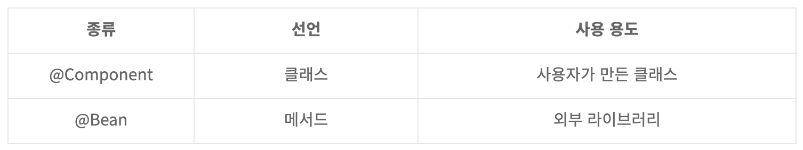
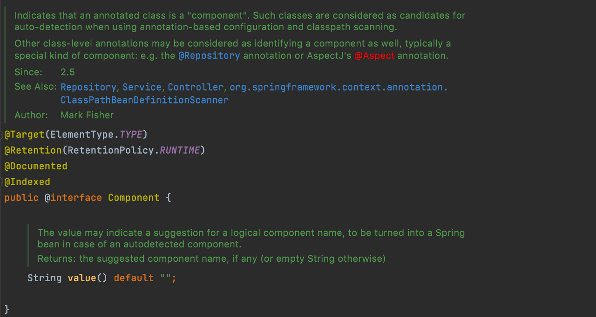
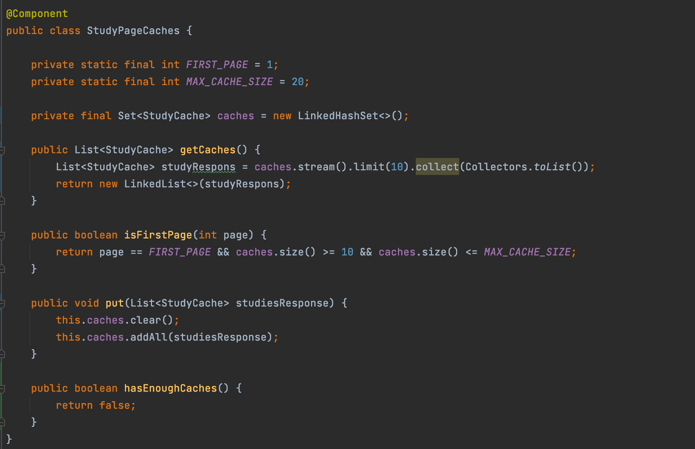
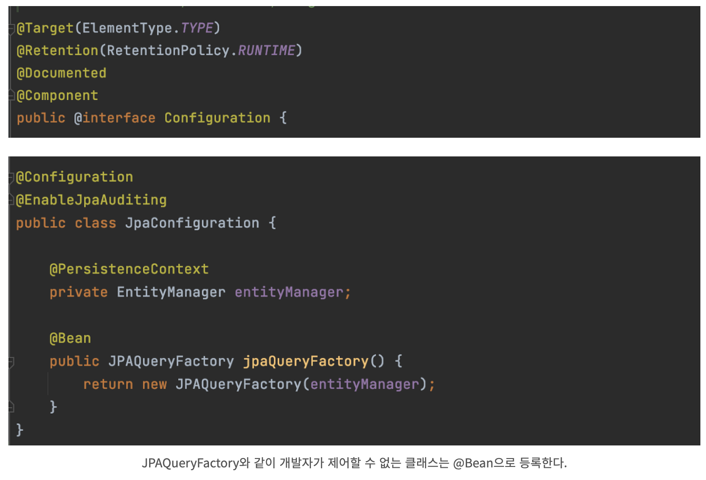
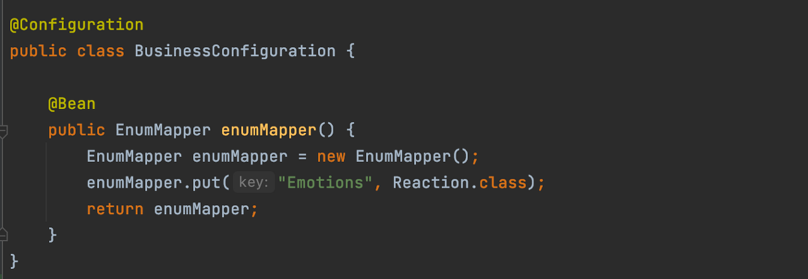
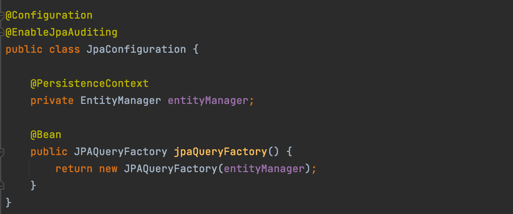

## @Configuration / @Component

@Component와 @Comfiguration의 차이에 관해
정리해보겠습니다. [결론부터 말하면 @Component는 개발자가 작성한 클래스를 Bean으로 등록할 때 사용하고 @Configuration + @Bean은 개발자가 직접 제어하기 힘든 클래스를 빈으로 등록할때 사용](https://stackoverflow.com/questions/39174669/what-is-the-difference-between-configuration-and-component-in-spring)
합니다.

        

## 1. @Component / @Configuration

@Component가 달린 클래스는 자동으로 스프링 컴포넌트 스캔 대상이 되기 때문에 별도로 Bean을 등록하지 않아도 사용할 수 있습니다. 이는 스테레오 타입 어노테이션을 사용하는 클래스에 달려 있는데요, 스테레오
타입이란 우리가 흔히 사용하는 @Controller, @Service, @Repository 등의 스프링 컨테이너가 스프링 관리 컴포넌트로 식별하게 해주는 단순한 마커라고 보면됩니다.

 

이전 버전에서는 XML 파일에 Bean을 모두 명시하고 관리했지만 이때문에 XML 파일이 거대해졌습니다. 이런 문제를 해결하기 위해 특정 버전부터 어노테이션이 등장했고 이를 통해 간략하게 빈을 등록/생성할 수 있게
되었습니다.

&nbsp;&nbsp; - Spring 2.0 : @Repository  
&nbsp;&nbsp; - Spring 2.5 : @Component, @Controller, @Service, @Configuration  

        

이는 아래와 같이 개발자가 직접 만든 클래스를 빈으로 등록하고 싶을때 사용합니다.

        

@Configuration 클래스에는 클래스 내부에 하나 이상의 @Bean 메서드를 선언해 사용합니다. 사실 @Configuration 내부에는 @Component 어노테이션이 존재하기 때문에 동작 원리는
같습니다. **뿐만
아니라 [@Component + @Bean의 조합도 사용가능](https://9327144.tistory.com/entry/Spring-Configuration%EA%B3%BC-Component-%EA%B7%B8%EB%A6%AC%EA%B3%A0-Bean)
합니다.

        

또한 구현 나름이겠지만 해당 클래스를 개발자가 만들었고 제어가 가능하지만, 빈으로 등록하면서 내부에 값을 저장할때도 이런 방식으로 빈을 사용할 수도 있습니다. **Component로 만들고 생성자 블록에서 이를
초기화해주는 것도 상관없습니다. 이는 구현 나름입니다.

        

## 2. 차이점

@Configuration 내부에는 @Component 어노테이션이 존재하기 때문에 @Bean과 @Component를 비교해봐야합니다. @Component는 개발자가 작성한 클래스에 선언되어 빈으로 등록 할 수
있다고 했는데요, 라이브러리 혹은 내장 클래스 등 `개발자가 직접 제어가 불가능한 클래스들도 존재`합니다. 이런 클래스를 빈으로 등록해서 싱글톤으로 관리해주고 싶을 때 @Bean을 사용하여 등록해줄수 있습니다.

        

## 3. 결론

즉, @Component는 개발자가 직접 만든 클래스를 빈으로 등록해주고 싶을때 사용하며, @Configuration + @Bean은 개발자가 직접 제어할 수 없는 클래스를 빈으로 등록할때 사용하는 것입니다.
