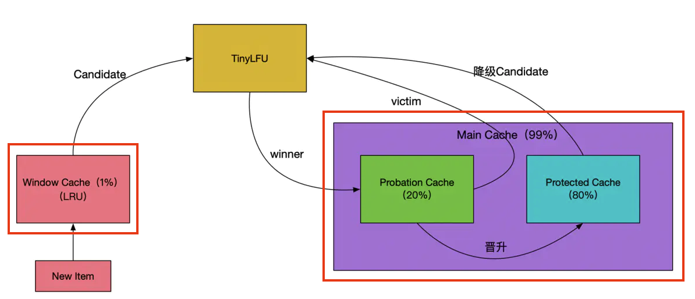

## ☕ [Caffeine Cache](https://github.com/ben-manes/caffeine)

<br/>

<div align="center">


</div>

<br/>

<div align="center">

`Caffeine is a high performance, near optimal caching library.`

</div>

<div align="center">


[](https://github.com/ben-manes/caffeine) [](https://github.com/ben-manes/caffeine/wiki)

</div>

<br/><br/><br/><br/><br/><br/>

## 1. Caffeine Cache

고성능의 최적의 캐싱 라이브러리. 먼저 어떻게 Caffeine이 이를 최적화 시키는지에 대해 살펴보겠습니다. 

- Guava Cache와 ConCurrentHashMap을 개선한 [ConcurrentLinkedHashMap](https://github.com/ben-manes/concurrentlinkedhashmap)을 바탕으로 구현
- In-Mermory 기반
- [SpringBoot-Starter-Cache에 Auto-Configured](https://docs.spring.io/spring-boot/docs/2.0.x/reference/html/boot-features-caching.html#boot-features-caching-provider-caffeine)
- `Java 8`, `Spring 4.3, Boot 1.4 이상`에서 지원
- 캐시 제거 전략에 우선순위 부여
- Window TinyLfu 알고리즘 사용

<br/><br/><br/><br/><br/><br/><br/><br/>

### 1-1. [W-TinyLFU algorithm](W-TinyLFU algorithm)

Caffeine은 LFU와 LRU의 장점을 통합하며, 캐시 항목을 다양한 특성을 가진 캐시 영역에 저장합니다. 최근에 생성된 캐시 항목은 `Window 영역`에 들어가고 삭제되지 않으며, 빈도가 높은 캐시 항목은 `Protected 영역`에 들어가고 삭제되지 않습니다. 그리고 두 영역 사이에 있는 캐시 항목들은 `Probation 영역`에 존재하며, 캐시 공간이 가득 차면 Probation 영역의 캐시 항목들은 액세스 빈도에 따라 유지/제거됩니다. 이를 통해 액세스 빈도와 접근 시간의 신선도 두 가지 측면을 잘 균형 잡힌 캐싱 전략을 구현하며, 높은 액세스 빈도를 가진 신선한 캐시 항목들을 최대한 캐시에 유지합니다. 또한 동시에 캐시 항목의 액세스 빈도를 유지하는 데 카운터 포화 및 감쇄 메커니즘을 도입하여 저장 공간을 절약하고, 기존의 전통적인 LRU와 LFU로 처리하기 어려운 희소한 트래픽과 단기간의 초과 트래픽과 같은 시나리오를 더 잘 다룰 수 있습니다.


> TinyLFU 제거 메커니즘은 다음과 같습니다. Window Cache 또는 Protected Cache에서 제거된 캐시 항목을 Candidate라고 하며, Probation Cache에서 가장 오래된 캐시 항목을 Victim이라고 합니다. Candidate의 액세스 빈도가 Victim의 액세스 빈도보다 크다면, Victim은 제거됩니다. 만약 Candidate의 빈도가 Victim의 빈도보다 작거나 같다면 Candidate가 제거되며, 그렇지 않으면 Candidate와 Victim 중 하나가 무작위로 제거됩니다.

<br/><br/><br/><br/><br/><br/><br/><br/>

이에 대해 조금 더 자세히 살펴보겠습니다. W-TinyLFU는 캐시 저장 공간을 두 개의 큰 영역으로 분할합니다: Window Cache와 Main Cache입니다. Window Cache는 표준 LRU 캐시이며, Main Cache는 SLRU(Segmented LRU) 캐시입니다.




<br/><br/><br/><br/><br/><br/><br/><br/>

Main Cache는 또한 Protected Cache와 Probation Cache로 나뉘며, 둘 다 LRU 기반의 캐시입니다. Protected Cache는 캐시 항목이 삭제되지 않는 영역이며, Probation Cache는 새로운 캐시 항목이 Probation 영역에 들어가야 할 경우, 관찰 영역에 이미 가득 찼다면 LRU 규칙에 따라 제거해야 할 Probation 영역의 캐시 항목들과 비교해 새로운 캐시 항목을 추가하거나 기존의 캐시 항목들을 Probation 영역에 유지합니다.


> Window Cache의 기본 크기는 전체 캐시 크기의 1%이고, Main Cache의 기본 크기는 전체 캐시 크기의 99%입니다. Protected Cache의 기본 크기는 Main Cache 크기의 80%이고, Probation 영역의 기본 크기는 Main Cache 크기의 20%입니다. 물론 이러한 캐시 영역의 크기는 동적으로 조정될 수 있습니다.

<br/><br/><br/><br/><br/><br/><br/><br/>

새로운 캐시 항목이 캐시에 쓰일 때 먼저 Window Cache 영역에 쓰이며, Window Cache 공간이 가득 차면 가장 오래된 캐시 항목이 Window Cache에서 제거됩니다. Probation Cache가 가득 차지 않았다면, Window Cache에서 이동된 캐시 항목은 바로 Probation Cache에 쓰입니다. Probation Cache가 가득 찼다면, Window Cache에서 제거된 캐시 항목은 TinyLFU 알고리즘에 따라 Probation Cache에 기록되거나 제거됩니다. Probation Cache의 캐시 항목들이 일정 횟수 이상 액세스 되면 Protected Cache로 승격됩니다. 만약 Protected Cache도 가득 찼다면, 가장 오래된 캐시 항목들은 Protected Cache에서도 제거하며, 그 후 TinyLFU 알고리즘에 따라 Probation Cache에 유지하거나 제거됩니다.


<br/><br/><br/><br/><br/><br/><br/><br/>

### 1-2. Count-Min Sketch

일종의 확률적 데이터 구조로 `주어진 데이터의 빈도를 추정하는 데 사용`됩니다. 이 알고리즘은 작은 메모리 공간에 빈도 통계를 유지하는 것을 목표로 하며, 이러한 특징으로 인해 Caffeine 캐시에서 LFU 빈도 통계를 위해 활용됩니다. 주요 원리는 아래와 같습니다.

<br/><br/><br/><br/>

Count-Min Sketch는 2의 n 제곱으로 반올림한 캐시 공간 용량(캐시 항목의 최대 수) 크기의 long[] 테이블 배열을 가지고 있습니다. Count-Min Sketch의 카운터는 4비트이며 테이블 배열의 각 요소의 크기는 64비트로 16개의 카운터를 포함하는 테이블 요소와 같습니다. 16개의 카운터는 다시 4개의 그룹으로 나누어 각 그룹은 4개의 카운터를 포함하는데, 이는 블룸 해시 함수의 수와 정확히 같으며, 동일한 키의 4개의 카운터는 그룹 내 해당 위치의 카운터를 사용합니다. 각 테이블 요소에는 16개의 카운터가 포함되어 있으며 `해당 테이블 요소의 4개 해시 카운터의 오프셋이 같지 않아 해시 충돌을 효과적으로 줄일 수` 있습니다.


<br/><br/><br/><br/><br/><br/><br/><br/>

캐시 항목을 계산하는 프로세스는 다음과 같습니다. 먼저 캐시 항목 키의 해시값을 계산한 다음 4개의 다른 시드 값을 사용하여 테이블 배열의 4개 요소의 위치를 계산합니다. 첫 번째 카운터 위치는 첫 번째 테이블 배열 요소의 해당 그룹 내 첫 번째 카운터, 두 번째 카운터 위치는 두 번째 테이블 배열 요소의 해당 그룹 내 두 번째 카운터, 세 번째 카운터 위치는 세 번째 테이블 배열 요소의 해당 그룹 내 세 번째 카운터, 네 번째 카운터 위치는 세 번째 테이블 배열 요소의 해당 그룹 내 세 번째 카운터, 네 번째 카운터 위치는 네 번째 테이블 배열 요소의 해당 그룹에 있는 네 번째 카운터입니다. Caffeine 캐시에서 LFU 빈도 통계에 Count-Min Sketch 알고리즘을 활용하면 `작은 메모리 공간으로도 상대적으로 정확한 빈도 통계를 유지`하며, 이를 통해 `캐시 성능을 최적화`하고 `메모리 효율성을 높이는 데 도움`이 됩니다.

> 이에 대해서는 [해당 블로그](https://uiandwe.tistory.com/1336)의 설명을 참조해주세요.


<br/><br/><br/><br/><br/><br/><br/><br/>

여기서 사용되는 개념들을 다시 한 번 살펴보면 아래와 같습니다.

&nbsp;&nbsp; - 테이블 배열: Count-Min Sketch는 길이가 N인 테이블 배열을 가집니다. 이 배열은 일반적으로 많은 카운터를 가집니다. <br/>
&nbsp;&nbsp; - 해시 함수: K개의 서로 다른 해시 함수를 사용합니다. 각 해시 함수는 데이터 항목을 테이블 배열의 K개 위치 중 하나로 매핑합니다.

&nbsp;&nbsp; - 카운팅: 데이터 항목이 주어지면 각 해시 함수를 사용하여 해당 항목을 테이블 배열에서 K개의 위치로 매핑하며 해당 위치의 카운터를 1씩 증가시킵니다.

&nbsp;&nbsp; - 빈도 추정: 데이터 항목의 빈도를 추정하기 위해, 해당 항목을 테이블 배열의 K개 위치에서 찾아 카운터 값들 중 가장 작은 값을 선택합니다. 이 최소값이 해당 데이터 항목의 추정 빈도입니다.

> Count-Min Sketch는 작은 메모리로도 상대적으로 정확한 빈도 추정을 가능케 하며, 더 많은 메모리를 할당할수록 정확도가 향상됩니다.


<br/><br/><br/><br/><br/><br/><br/><br/>

## 2. 다른 캐시와 비교 

자바에서 대표적으로 많이 사용되는 캐시 라이브러리는 Ehcache, Guava 등이 있습니다. 이 중 대표적으로 많이 사용되는 Ehcache와 간략히 비교해 보겠습니다.

<br/><br/><br/><br/>

[Ehcache](https://www.ehcache.org/) 는 `Java 기반의 오픈 소스 인메모리 캐싱 라이브러리`로, 기본적으로 스프링과 같은 자바 애플리케이션과 통합해 사용합니다. 이는 별도의 데몬을 가지지 않으며, 애플리케이션 자체의 메모리 내에서 캐싱을 처리합니다. 그러나 Ehcache를 분산 캐시로 사용하기 위해 Terracotta Server와 함께 사용할 수도 있습니다. 


> 더 자세한 내용은 [해당 링크](https://github.com/ehcache)를 참조해주세요. 

<br/><br/><br/><br/><br/><br/><br/><br/>

[Ehcache](https://www.ehcache.org/documentation/3.10/tiering.html)의 세부적 특징은 아래와 같습니다. 

- Multi-level Cache 제공 
- Distributed Cache 제공
- LRU(Least Recent Used), LFU(Least Frequency Used), FIFO(First In First Out) 제거 알고리즘 제공
- 각 애플리케이션의 cache를 Terracotta Server를 활용하여 동기화해 사용 가능
- [JMX 모니터링으로 모니터링 가능](https://www.ehcache.org/documentation/2.8/operations/jmx.html)

> 물론 성능이라는 것은 어떤 환경인지에 따라 다르기 때문에 단순 지표로만 판단하긴 힘듭니다.

<br/><br/><br/><br/><br/><br/><br/><br/>

기능만 보면 비슷한 것들이 많고, Multi-level Cache, Distributed Cache 등 Ehcache가 제공하는 기능이 훨씬 많습니다. 하지만 Caffeine 캐시는 `더 작고 가벼우며` `성능상 이점`을 가지고 있습니다. 또한 `비교적 구현/사용하기 쉬우며`, `뛰어난 캐시 정책`을 가지고 있기에 이를 사용합니다. 

[](https://levelup.gitconnected.com/supercharge-java-applications-unlock-ultimate-performance-with-high-speed-caching-d7503a47be08)

> 물론 성능이라는 것은 어떤 환경인지에 따라 다르기 때문에 단순 지표로만 판단하긴 힘듭니다.


<br/><br/><br/><br/><br/><br/><br/><br/>

여기에 대해 추가로 읽어볼 만한 글이 있는데요, 시간이 되면 한 번 읽어보실 것을 권장드립니다. 

&nbsp;&nbsp; - [Caffeine versus Guava cache](https://stackoverflow.com/questions/55494488/caffeine-versus-guava-cache) <br/>
&nbsp;&nbsp; - [Why did Spring framework deprecate the use of Guava cache?](https://stackoverflow.com/questions/44175085/why-did-spring-framework-deprecate-the-use-of-guava-cache)<br/>
&nbsp;&nbsp; - [StackOverFlow Caffeine-Cache taged](https://stackoverflow.com/questions/tagged/caffeine-cache?tab=Votes)

<br/><br/><br/><br/><br/><br/><br/><br/>

## 3. Benchmarks

벤치마크 성능에 대해 살펴보겠습니다. 더 자세한 정보는 [해당 링크](https://github.com/ben-manes/caffeine/wiki/Benchmarks)를 참조해주세요.

<br/><br/><br/><br/>

### 3-1. Compute

캐시는 제한되지 않고 완전히 채워지며 계산은 일정한 값을 반환합니다. 이는 항목이 있을 때 잠금으로 인한 오버헤드를 보여줍니다. 카페인은 호출이 없을 경우 원자 계산으로 돌아가기 전에 잠금이 없는 사전 검사를 수행합니다. 그래프로 표시된 시나리오는 단일 항목을 검색하는 모든 스레드와 Zipf 분포를 기반으로 서로 다른 키를 검색하는 스레드 입니다.


> In this benchmark the caches are unbounded, fully populated, and the computation returns a constant value. This benchmark demonstrates the overhead due to locking when the entry is present. Caffeine performs a lock-free prescreening before falling back to an atomic compute if absent call. The scenarios graphed are all threads retrieving a single entry ("sameKey") and threads retrieving different keys based on a Zipf distribution ("spread").

<br/><br/><br/><br/><br/><br/><br/><br/>

### 3-2. Read

최대 크기로 구성된 캐시에서 8개의 스레드를 동시에 읽습니다.


> In this benchmark 8 threads concurrently read from a cache configured with a maximum size.

<br/><br/><br/><br/><br/><br/><br/><br/>

### 3-3. Read (75%) / Write (25%)

이 벤치마크에서는 6개 스레드를 동시에 읽고 2개 스레드를 최대 크기로 구성된 캐시에 씁니다.


> In this benchmark 6 threads concurrently read from and 2 threads write to a cache configured with a maximum size.

<br/><br/><br/><br/><br/><br/><br/><br/>

### 3-4. Write (100%)

이 벤치마크에서는 최대 크기로 구성된 캐시에 8개 스레드를 동시에 씁니다.


> In this benchmark 8 threads concurrently write to a cache configured with a maximum size.

<br/><br/><br/><br/><br/><br/><br/><br/>


## 4. 특징 

Caffeine의 특징에 대해 살펴보겠습니다. 

<br/><br/><br/><br/>

### 4-1. 자동 로딩 

한 번 읽어온 값은 캐시에서 로딩되기 때문에 별도의 설정이 필요 없습니다.

```java
@Transactional(readOnly = true)
@Cacheable(cacheNames = "district")
public DistrictResponse findDistrictById(Long districtId){
        District findDistrict=districtJpaRepository.findDistrictByDistrictId(districtId)
            .orElseThrow();
        return DistrictResponse.of(findDistrict);
}
```


<br/><br/><br/><br/><br/><br/><br/><br/>

### 4-2. 갱신

아래와 같이 캐시 저장 기간을 간편하게 제어할 수 있습니다.

```java
@EnableCaching
@Configuration
public class CacheConfiguration {

    @Bean
    public Caffeine<Object, Object> caffeineConfig() {
        return Caffeine.newBuilder()
                .expireAfterWrite(1, HOURS);
    }

    @Bean
    public CacheManager cacheManager(Caffeine<Object, Object> caffeine) {
        CaffeineCacheManager caffeineCacheManager = new CaffeineCacheManager();
        caffeineCacheManager.setCaffeine(caffeine);
        return caffeineCacheManager;
    }
}
```

<br/><br/><br/><br/><br/><br/><br/><br/>

그뿐만 아니라 @CacheEvict를 통해 특정 캐시 또는 전체 캐시를 갱신할 수도 있습니다.

```java
@CacheEvict(value = "district", key = "#district")
public void evictCache(String district) {
        log.info("Evict Specific Cache.");
}

@CacheEvict(value = {"district"}, allEntries = true) 
public void evictAllCache() {
        log.info("Evict All Caches.");
}
```

<br/><br/><br/><br/><br/><br/><br/><br/>

### 4-3. 통계

또한 캐시에 대해 [통계](https://github.com/ben-manes/caffeine/wiki/Statistics)를 낼 수도 있는데요, 이를 통해 실시간으로 캐시 정보에 대해 알 수 있습니다.

```java
Cache<Key, Graph> graphs = Caffeine.newBuilder()
    .maximumSize(10_000)
    .recordStats()
    .build();
```

<br/>
