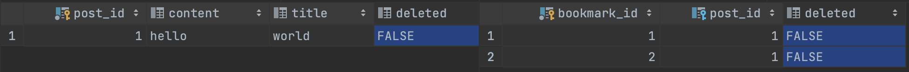
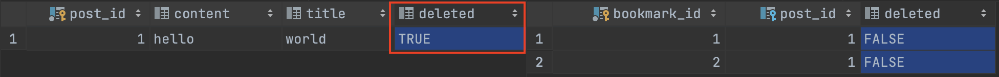
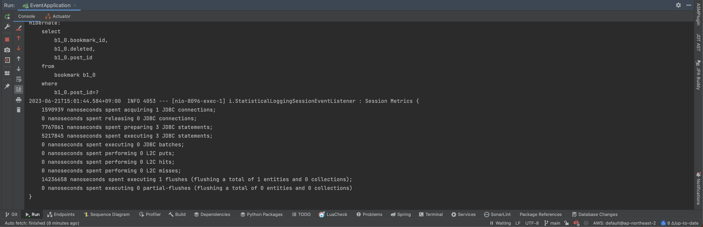
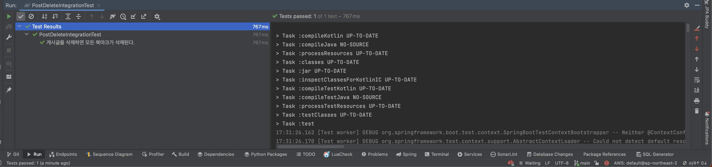

## 모놀리식 아키텍처에서 도메인 이벤트 사용

모놀리식 아키텍처에서 도메인 이벤트 사용에 대해 작성한 내용입니다. 학습 과정에서 작성되었기 때문에 잘못된 내용이 있을 수 있으며 이에 대한 지적/피드백은 언제든 환영입니다.

<br/><br/><br/><br/>

## 1. 예제

게시글을 삭제하면 연관된 북마크가 모두 삭제되는 간단한 예제를 살펴보겠습니다. 진행 과정은 `게시글 삭제 -> 이벤트 발행 -> 북마크 삭제` 순입니다.

````kotlin
@Service
class PostCommandService(
    private val postRepository: PostCommandRepository,
    private val applicationEventPublisher: ApplicationEventPublisher
) {

    @Transactional
    fun publishEvent(postId: Long) {
        val findPost = postRepository.findById(postId).get()
        applicationEventPublisher.publishEvent(PostDeleteEvent(findPost.postId!!))
        findPost.delete()
    }
}
````

```kotlin
@Component
class BookmarkEventHandler(
    private val bookmarkService: BookmarkCommandService
) {

    @TransactionalEventListener
    fun listenEvent(event: PostDeleteEvent) {
        val post = event.postId
        bookmarkService.deleteAll(post)
    }
}
```

```kotlin
@Service
class BookmarkCommandService(
    private val bookmarkCommandRepository: BookmarkCommandRepository
) {

    @Transactional
    fun deleteAll(postId: Long) {
        val bookmarks = bookmarkCommandRepository.findAllBookmarksById(postId)
        bookmarks.map { it.delete() }
    }
}
```

<br/><br/><br/><br/><br/><br/><br/><br/>

### 1.1 일부러 예외 던지기

여기서 북마크 삭제에서 일부러 예외를 던져보겠습니다.

```kotlin
@Service
class BookmarkCommandService(
    private val bookmarkCommandRepository: BookmarkCommandRepository
) {

    @Transactional
    fun deleteAll(postId: Long) {
        val bookmarks = bookmarkCommandRepository.findAllBookmarksById(postId)
        bookmarks.map { it.delete() }
        throw RuntimeException()
    }
}
```

<br/><br/><br/><br/><br/><br/><br/><br/>

실험 전 데이터베이스의 상태는 아래와 같습니다.



<br/><br/><br/><br/><br/><br/><br/><br/>

게시글을 삭제하는 최상위 메서드에서 @Transactional을 사용했기 때문에 당연히 모두 삭제되고 성공할 것이라 예상했습니다. 그런데 결과는 게시글은 삭제됐지만 북마크는 삭제되지 않았습니다.



<br/><br/><br/><br/><br/><br/><br/><br/>

더 문제는 북마크가 삭제되지 않은 것에 대해 아무런 예외가 발생하지 않은 것입니다. 즉 게시글은 삭제되었지만 즐겨찾기는 여전히 남아있으며 북마크가 실패한 것에 대한 어떤 상태도 알 수 없습니다.



<br/><br/><br/><br/><br/><br/><br/><br/>

### 1-2. 원인

원인은 @TransactionalEventListener의 TransactionPhase 기본 전략이 `TransactionPhase.AFTER_COMMIT` 이기 때문입니다.

```kotlin
@Target({ ElementType.METHOD, ElementType.ANNOTATION_TYPE })
@Retention(RetentionPolicy.RUNTIME)
@Documented
@EventListener
public @ interface TransactionalEventListener {

    ......

    TransactionPhase phase() default TransactionPhase.AFTER_COMMIT;

    ......

}
```

<br/><br/><br/><br/><br/><br/><br/><br/>

TransactionPhase.AFTER_COMMIT의 설명을 살펴보면 아래와 같습니다. 즉 부모 커밋이 실행된 후 해당 이벤트가 실행되는 것입니다. 게시글이 삭제된 후 커밋이 완료되면 이벤트가 발행되기 때문에 하위
트랜잭션이 실패하더라도 부모 트랜잭션에 전혀 영향을 주지 않는 것입니다.

```kotlin
    /**
 * Handle the event after the commit has completed successfully.
 * <p>Note: This is a specialization of {@link #AFTER_COMPLETION} and therefore
 * executes in the same sequence of events as {@code AFTER_COMPLETION}
 * (and not in {@link TransactionSynchronization#afterCommit()}).
 * <p>Interactions with the underlying transactional resource will not be
 * committed in this phase. See
 * {@link TransactionSynchronization#afterCompletion(int)} for details.
 * @see TransactionSynchronization#afterCompletion(int)
 * @see TransactionSynchronization#STATUS_COMMITTED
 */
```

<br/><br/><br/><br/><br/><br/><br/><br/>

### 1-3. 해결 방법

모놀리식 아키텍처를 사용하고 있다면 해결 방법은 간단합니다. 아래와 같이 `@TransactionalEventListener(phase = TransactionPhase.BEFORE_COMMIT)`을 붙여주면
됩니다.

````kotlin
@Component
class BookmarkEventHandler(
    private val bookmarkService: BookmarkCommandService
) {

    @TransactionalEventListener(phase = TransactionPhase.BEFORE_COMMIT)
    fun listenEvent(event: PostDeleteEvent) {
        val post = event.postId
        bookmarkService.deleteAll(post)
        throw IllegalArgumentException()
    }
}
````

<br/><br/><br/><br/><br/><br/><br/><br/>

TransactionPhase.BEFORE_COMMIT은 아래와 같습니다.

```kotlin
public enum TransactionPhase {

    /**
     * Handle the event before transaction commit.
     * @see TransactionSynchronization#beforeCommit(boolean)
     */
    BEFORE_COMMIT

    ......
```

<br/><br/><br/><br/><br/><br/><br/><br/>

TransactionalApplicationListenerSynchronization에서 커밋이 발생하기 전 이를 실행시켜 주는 것입니다.

````kotlin
class TransactionalApplicationListenerSynchronization<E extends ApplicationEvent >
        implements TransactionSynchronization {

    private final E event;

    private final TransactionalApplicationListener<E> listener;

    private final List<TransactionalApplicationListener.SynchronizationCallback> callbacks;

    ......

    @Override
    public void beforeCommit(boolean readOnly) {
        if (this.listener.getTransactionPhase() == TransactionPhase.BEFORE_COMMIT) {
            processEventWithCallbacks();
        }
    }

    ......
````

<br/><br/><br/><br/><br/><br/><br/><br/>

테스트를 돌려보면 아래와 같이 북마크 삭제가 하나의 트랜잭션에 묶이는 것을 볼 수 있습니다.

```kotlin
@SpringBootTest
@ActiveProfiles("test")
class PostDeleteIntegrationTest {

    @Autowired
    private lateinit var persistenceHelper: PersistenceHelper

    @Autowired
    private lateinit var postCommandService: PostCommandService

    @Test
    @DisplayName("게시글을 삭제하면 모든 북마크가 삭제된다.")
    fun when_delete_post_then_all_bookmarks_should_be_deleted() {
        val newPost = given()
        postCommandService.publishEvent(newPost.postId!!)

        val findBookmarks = persistenceHelper.findBookmarksById(newPost.postId!!)
        assertEquals(0, findBookmarks.size)
    }

    private fun given(): Post {
        val newPost = persistenceHelper.persist(Post(null, "Hello", "World"))
        persistenceHelper.persist(Bookmark(null, newPost))
        persistenceHelper.persist(Bookmark(null, newPost))
        return newPost
    }
}
```



<br/><br/><br/><br/><br/><br/><br/><br/>

## 2. 정리

물론 이를 통해 해결할 수도 있는데요, 이는 `완전한 느슨한 결합`은 아닙니다. 하나의 트랜잭션에 다음 작업이 포함되는 `종속성`이 발생하기 때문입니다. 도메인 이벤트를 사용하는 이유는 `의존성을 낮추기 위함`
인데요, 이를 위해서는 한 도메인/모듈에 다른 도메인/모듈이 영향을 받아서는 안 됩니다. 하지만 이번 예제에서는, 이번 해결 방법에서는 게시글 북마크 삭제가 실패하면 게시글 삭제도 실패하기 때문에 이는 완벽한 느슨한
결합은 아닙니다.

<br/>

그런데 `단일 애플리케이션을 사용하면서 완전한 느슨한 결합을 구현해야 할까?`에 대해 생각해보면 하나의 작업에서 트랜잭션을 별도로 관리하는 것은 `더 비효율적이다.`라는 생각이 들었습니다. 게시글이 삭제되고 모든
북마크가 삭제돼야 하며, 북마크까지 다 삭제돼야 하나의 작업이 완료되는 것이기 때문입니다. 북마크 삭제가 다른 트랜잭션으로 관리되고, 이 작업이 실패했을 때 Retry나 복구 로직을 구현하기는 훨씬 어렵고
복잡합니다. 따라서 단일 모듈을 사용한다면 `코드 레벨에서는 느슨한 결합`을 구현하고 서비스가 커졌을 경우 다시 생각해 보는 것이 좋다고 생각합니다.

<br/>

