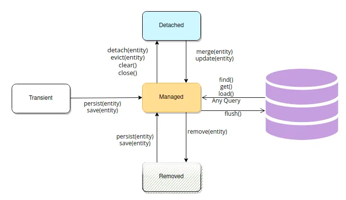
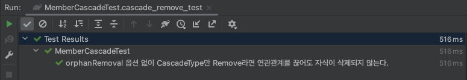
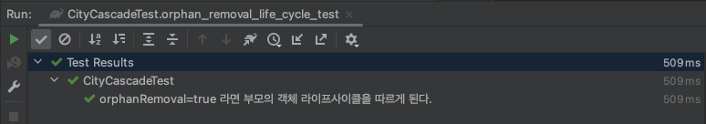

## 💬 JPA

Hibernate/JPA learning repository.


<div align="center">

[](https://docs.spring.io/spring-data/jpa/docs/current/reference/html/)
[](https://hibernate.org/orm/documentation/6.2/)
</div>

<br/><br/><br/><br/>

## CasCade

Cascade는 데이터베이스 외래 키에 대한 작업을 수행할 때 사용할 수 있는 옵션으로, 외래 키 값에 대한 업데이트나 삭제 작업이 발생했을 때 관련된 다른 테이블의 행에도 해당 작업을 자동으로 전파시키는 기능을 말합니다.

> [CASCADE in SQL is used to simultaneously delete or update an entry from both the child and parent table. The keyword CASCADE is used as a conjunction while writing the query of ON DELETE or ON UPDATE. If the cascade keyword is added to a query written for the parent table, then both the parent and child tables change accordingly on the execution of the query.](https://www.scaler.com/topics/sql/cascade-in-sql/)

<br/><br/><br/><br/><br/><br/><br/><br/>

JPA에서도 비슷한데요, CasCade 옵션을 통해 엔티티가 변경될 때 `상태 변화를 전파` 시킬 수 있습니다. `엔티티의 상태`는 크게 네 가지가 존재하며 아래와 같습니다.

- Transient: 객체를 생성하거나 값을 부여해도 JPA/Hibernate가 객체에 대해 아무것도 모르는 상태.

- Persistent: 엔티티를 저장한 순간 JPA가 이를 감지하는 상태. 이때 주의해야 할 점은 save 메서드를 호출 했다고 해서 곧 바로 DB에 저장되지는 않습니다. JPA가 영속 상태로 관리하고 있다가 후에 데이터를 저장합니다. `Write Behind`

- Detached: JPA가 더이상 관리하지 않는 상태. JPA가 제공해주는 기능들을 사용하려면 다시 영속 상태로 만들어야 합니다.
- Removed: JPA가 관리하는 상태이긴 하지만, 실제 커밋이 일어날 때 삭제되는 상태.


<br/><br/><br/><br/><br/><br/><br/><br/>

이는 [엔티티 라이프 사이클(Life Cycle)](https://www.mastertheboss.com/java-ee/jpa/understanding-jpa-entity-life-cycle/) 이라고 합니다. 




<br/><br/><br/><br/><br/><br/><br/><br/>

CasCade 옵션은 아래와 같이 사용할 수 있는데요, CascadeType은 Enum으로 제공되며 아래와 같은 설정이 있습니다. 사용법에 대해서는 관련된 설명/자료가 많으므로 헷갈리는 상황에 대해서만 살펴보겠습니다.

```kotlin
@Entity
class City(
    ......
) {
    @OneToMany(mappedBy = "city", cascade = [CascadeType.PERSIST, CascadeType.REMOVE], orphanRemoval = true)
    private var _districts: MutableList<District> = ArrayList()
}
```

```kotlin
public enum CascadeType { 

    /** Cascade all operations */
    ALL, 

    /** Cascade persist operation */
    PERSIST,

    /**
     * - 엔티티 상태를 병합 할 때, 연관된 엔티티도 함께 병합
     * - 트랜잭션이 종료되고 DETACHED 상태에서 엔티티가 merge( )를 수행하게 되면 연관 엔티티의 추가 및 수정사항도 함께 적용
    */
    MERGE,

    /**
     * 엔티티를 삭제할 때, 연관된 엔티도 함께 삭제
     */
    REMOVE,

    /**
     * 상위 엔티티를 REFRESH 할 때, 연관된 엔티티도 모두 REFRESH
     */
    REFRESH,

    /**
     * 부모 엔티티가 detach()를 수행하게 되면, 연관된 엔티티도 DETACHED 상태가 되어 변경사항이 반영 X
     */   
    DETACH
}
```


<br/><br/><br/><br/><br/><br/><br/><br/> 


## CasCadeType.REMOVE vs orphanRemoval = true

결론부터 말하면 CascadeType.REMOVE와 orphanRemoval = true는 `부모 엔티티를 삭제하면 자식 엔티티도 함께 삭제`합니다. 하지만 부모 엔티티에서 자식 엔티티 제거할 때 CascadeType.REMOVE는 자식 엔티티가 그대로 남아있는 반면, orphanRemoval = true는 자식 엔티티를 제거합니다. 테스트를 통해 이를 알아보겠습니다. 


<br/><br/><br/><br/>


우선 팀(Team)과 회원(Member)는 일대 다의 관계입니다. 회원 쪽에는 `CasCadeType이 REMOVE`로 지정되어 있고 `orphanRemoval에 대한 설정은 없습니다.`

```kotlin
@Entity
class Member(
    ......
) {
    @ManyToOne(fetch = FetchType.LAZY)
    @JoinColumn(name = "team_id")
    private var team: Team? = null
        
    ......
```

```kotlin

@Entity
class Team(
    ......
) {
    @OneToMany(mappedBy = "team", cascade = [CascadeType.PERSIST, CascadeType.REMOVE])
    private var _members: MutableList<Member> = ArrayList()

    ......
```


<br/><br/><br/><br/><br/><br/><br/><br/>

다음은 도시(City)와 구역(District)의 관계입니다. 마찬가지로 일대 다의 관계입니다.

````kotlin
@Entity
class City(
    ......
) {
    @OneToMany(mappedBy = "city", cascade = [CascadeType.PERSIST, CascadeType.REMOVE], orphanRemoval = true)
    private var _districts: MutableList<District> = ArrayList()

    ......
````
```kotlin
@Entity
class District(
    ......
) {
    @ManyToOne(fetch = FetchType.LAZY)
    @JoinColumn(name = "city_id")
    private var city: City? = null

    ......
```

<br/><br/><br/><br/><br/><br/><br/><br/>

먼저 `단순 CasCadeType.REMOVE`를 테스트 해보겠습니다. 팀에서 회원을 등록하고 영속화한 후 다시 회원들을 제거합니다. 

```kotlin
class MemberCascadeTest {

    ......
    
    @Test
    @DisplayName("orphanRemoval 옵션 없이 CascadeType만 Remove라면 연관관계를 끊어도 자식이 삭제되지 않는다.")
    fun cascade_remove_test() {
        val messi = Member(null, "Messi")
        val xavi = Member(null, "Xavi")
        val team = Team(null, "FC Barcelona")

        team.register(mutableListOf(messi, xavi))
        teamJpaRepository.save(team)

        // 모두 제거해도 남아있음
        team.removeAll()

        // true 
        assertEquals(2, memberJpaRepository.findAll().size)
    }
}
```


<br/><br/><br/><br/><br/><br/><br/><br/>

결과를 보면 여전히 두 명인 것을 알 수 있는데요, 즉 `연관관계를 제거해도 이를 삭제하지 않습니다.`



<br/><br/><br/><br/><br/><br/><br/><br/>

반면 `orphanRemoval = true` 옵션을 준 경우는 진짜로 자식이 삭제됩니다. 정리해 보면 `"모두 부모가 삭제될 때 함께 삭제되는 것은 맞지만 orphanRemoval 옵션을 주지 않는다면 단순히 연관관계를 끊었다고 해서 자식 엔티티가 삭제되지는 않는다."` 입니다. 

```kotlin
class CityCascadeTest {
    
    ......
    
    @Test
    @DisplayName("orphanRemoval=true 라면 부모의 객체 라이프사이클을 따르게 된다.")
    fun orphan_removal_life_cycle_test() {
        val city = City(null, "서울")
        val gangseo = District(null, "강서구")
        val hwagok = District(null, "화곡")

        city.register(mutableListOf(gangseo, hwagok))
        cityRepository.save(city)

        // 자식 하나 제거
        city.remove(hwagok)
        cityRepository.save(city)

        // true
        assertEquals(1, cityRepository.findAll().size)
        assertEquals(1, districtRepository.findAll().size)
    }
}
```


