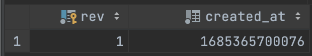

## ENVERS

Envers는 `JPA를 사용해 데이터베이스에서 변경 이력을 추적하고 조회하는 모듈`입니다. Envers는 객체 지향적 방식으로 엔티티의 상태 변화를 기록해 이력 정보를 쉽게 검색하고 복원할 수 있도록 도와줍니다.

> [Envers is a Hibernate module that adds auditing capabilities to JPA entities. This documentation assumes you are familiar with Envers, just as Spring Data Envers relies on Envers being properly configured.](https://docs.spring.io/spring-data/envers/docs/current/reference/html/)

<br/><br/><br/><br/><br/><br/><br/><br/>

먼저 의존성을 추가합니다.

````groovy
implementation("org.springframework.data:spring-data-envers:3.0.6")
````

<br/><br/><br/><br/><br/><br/><br/><br/>

이를 사용하기 위해서는 스프링 부트 main 메서드에 `@EnableJpaRepositories(repositoryFactoryBeanClass = EnversRevisionRepositoryFactoryBean::class)`와 엔티티에 `@Audited`를 추가해 줍니다.

```kotlin
@EnableJpaAuditing
@SpringBootApplication
@EnableJpaRepositories(repositoryFactoryBeanClass = EnversRevisionRepositoryFactoryBean::class)
class JpaApplication

fun main(args: Array<String>) {
    runApplication<JpaApplication>(*args)
}
```

````kotlin
@Audited    // 추가 
@Entity(name = "user")
@EntityListeners(value = [AuditingEntityListener::class])    
class User {
    @Id
    @GeneratedValue(strategy = GenerationType.IDENTITY)
    private var userId: Long? = null

    @Column
    private var nickname: String? = null

    @Column
    private var weight: Double? = null

    @Column
    private var phoneNumber: String? = null

    @Audited
    @Embedded
    private var auditedColumns: AuditedColumns = AuditedColumns(
        userId,
        Instant.now(),
        userId,
        null
    )

    ......
    
}
````

<br/><br/><br/><br/><br/><br/><br/><br/>

단일 데이터베이스를 사용할 때 아래의 설정만으로 동작하지만, 멀티 데이터 소스를 사용할 때는 별도의 설정이 필요합니다.

````kotlin
@Configuration
@EnableJpaRepositories(
        repositoryFactoryBeanClass = EnversRevisionRepositoryFactoryBean::class,
        entityManagerFactoryRef = "${ENTITY_MANAGER_FACTORY_REF}",
        transactionManagerRef = "${TRANSACTION_MANAGER_REF}",
        basePackages = {
                            
        })
class PrimaryDatabaseConfiguration {
    
    ......
}
````

<br/><br/><br/><br/><br/><br/><br/><br/>

이후 변경된 값들의 기록이 저장되는 REVINFO(revision_tracking) 테이블도 매핑해줍니다. 별도로 매핑해주지 않아도 테이블이 생성되지만, 이를 매핑하는 이유는 조금 있다 살펴보겠습니다.

````kotlin
@RevisionEntity
@Entity(name = "revision_tracking")
class RevisionTracker(
    @Id
    @RevisionNumber
    @GeneratedValue(strategy = GenerationType.IDENTITY)
    private var rev: Long? = null,

    @RevisionTimestamp
    private var createdAt: Long
) : Serializable {

    ......
    
}
````

````kotlin
interface CommonRepository : JpaRepository<RevisionTracker, Long>, RevisionRepository<RevisionTracker, Long, Long> {
}
````

<br/><br/><br/><br/><br/><br/><br/><br/>

이를 실행하면 아래와 같은 테이블이 생성되게 됩니다.

```sql
CREATE TABLE revision_tracking
(
    rev        BIGINT AUTO_INCREMENT PRIMARY KEY,
    created_at BIGINT NOT NULL
);
```

````sql
CREATE TABLE user_aud
(
    user_id      BIGINT                 NOT NULL PRIMARY KEY ,
    rev          BIGINT                 NOT NULL ,
    revtype      TINYINT                NULL ,
    created_at   DATETIME(6)            NULL ,
    created_by   BIGINT                 NULL,
    modified_by  BIGINT                 NULL,
    modified_at  DATETIME(6)            NULL,
    banned       ENUM ('TRUE', 'FALSE') NULL,
    nickname     VARCHAR(255)           NULL,
    phone_number VARCHAR(255)           NULL,
    weight       DOUBLE                 NULL,
    CONSTRAINT FK9f63gaxm79bxhgbglpn4kuht9 FOREIGN KEY (rev) REFERENCES revision_tracking (rev)
);
````

<br/><br/><br/><br/><br/><br/><br/><br/>

REVINFO 테이블은 revision_id와 timestamp 칼럼을 가지고 있으며 이력 테이블(user_aud)은 별도로 존재합니다. 이는 `동일 트랜잭션` 내에서 발생한 변경사항을 revision_id로 여러 이력 테이블에 각각 저장해 해당 트랜잭션에서 변경된 모든 이력을 추적/감시합니다. 트랜잭션 단위로 revision을 관리하기 때문에 한 트랜잭션에서 변경된 내용을 한 번에 파악할 수 있어 매우 편리합니다.

> 위에서 `REVINFO` 테이블을 왜 별도로 매핑하는지에 대해 의문이 들 수 있는데요, 이는 기본적으로 REVINFO 테이블의 PK가 INT이기 때문입니다. INT는 변경 사항이 많이 쌓이게 되면 금방 최대치를 초과할 수 있으므로 Long으로 바꾸는 것이 좋습니다.

<br/><br/><br/><br/><br/><br/><br/><br/>

또한 yml 설정을 통해 `동일 트랜잭션에서 함께 변경된 엔티티를 한 번에 조회`할 수도 있습니다.

```yaml
spring:
  jpa:
    hibernate:
      ddl-auto: ${DDL_AUTO}
    generate-ddl: ${GENERATED_DDL}
    show-sql: true
    properties:
      org:
        hibernate:
          envers:
            track_entities_changed_in_revision: true               # 같은 트랜잭션에서 함께 변경된 엔티티를 검색  
            audit_table_suffix: ${AUDIT_TABLE_SUFFIX}              # audit 테이블 suffix 
            revision_field_name: ${REVISION_FIELD_NAME}            # revision 필드명 
            revision_type_field_name: ${REVISION_TYPE_FIELD_NAME}  # revision 타입 필드명
```

<br/><br/><br/><br/><br/><br/><br/><br/>

이제 기본적인 이해가 끝났으니 사용자 정보를 업데이트해서 테이블을 살펴보겠습니다.

```kotlin
@RestController
@RequestMapping("/api/users")
class UserUpdateAPI(
    private val userUpdateService: UserUpdateService
) {

    @PutMapping("/{userId}")
    fun updateNickname(
        @PathVariable userId: Long,
        @RequestBody request: NicknameUpdateRequest
    ) {
        userUpdateService.updateNickname(
            userId,
            request.getNickname(),
            request.getWeight()
        )
    }
}
```

````kotlin
@Service
class UserUpdateService(private val userJpaRepository: UserJpaRepository) {

    @Transactional
    fun updateNickname(
        userId: Long,
        nickname: String,
        weight: Double
    ) {
        val findUser = userJpaRepository.findById(userId).orElseThrow();
        findUser.updateProfile(nickname, weight)
    }
}
````

````kotlin
interface UserJpaRepository : JpaRepository<User, Long> {
}
````

```http request
PUT localhost:8088/api/users/1
Content-Type: application/json

{
  "nickname": "HELLO!",
  "weight": 75
}
```

<br/><br/><br/><br/><br/><br/><br/><br/>

이를 업데이트 하면 아래와 같이 테이블에 변경 이력이 추적되는 것을 볼 수 있습니다.




<br/><br/><br/><br/><br/><br/><br/><br/>

revision_type의 숫자는 `INSERT(0)`, `UPDATE(1)`, `DELETE(2)`를 의미합니다. 칼럼에 contract_name_mod가 true/false로 표시될 수도 있는데요, 해당 설정을 제거하기 위해서는 어노테이션을 아래와 같이 설정해서 주시면 됩니다.

````kotlin
@Audited(withModifiedFlag = false)
````

> 더 자세한 설명을 보고 싶으시면 [스프링 캠프](https://www.youtube.com/watch?v=fGPaj-rlN5w) 세미나에서 영한님이 발표하신 내용을 참조해보세요. 

