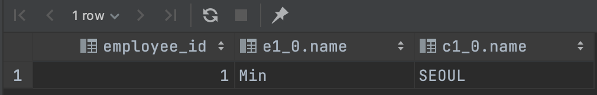

## 연관관계 없이 조인

테이블을 매핑하다보니 `두 엔티티가 반드시 연관관계를 가지는게 옳을까?`에 대한 의문이 들었습니다. 말로 설명하면 와닿지 않기 때문에 바로 예제로 살펴보겠습니다. 하나의 도시에는 여러 명의 고용자가 있는 경우입니다. 즉 도시:고용자 = 1:N의 관계가 되는데요, 이때 고용자들 측에서 반드시 `City를 객체로 가지고, 있어야 할까?`에 대한 의문이 들었습니다. 

```kotlin
@Entity
class Employee {
    @Id
    @GeneratedValue(strategy = GenerationType.IDENTITY)
    private var employeeId: Long? = null

    @Column
    private var name: String? = null

    @ManyToOne(fetch = FetchType.LAZY)
    @JoinColumn(name = "cityId")
    private val city: City            // 반드시 연관관계가 있어야 할까?

    ......
    
}
```

````kotlin
@Entity
class City{
    @Id
    @GeneratedValue(strategy = GenerationType.IDENTITY)
    private var cityId: Long? = null,

    @Column
    private var name: String,

    @UpdateTimestamp
    @Temporal(TemporalType.TIMESTAMP)
    @Column
    private val lastModifiedAt: Instant

    ......
    
}
````

<br/><br/><br/><br/><br/><br/><br/><br/>

일반적으로 매핑 한다면 아래와 같이 City 객체를 Employee 엔티티가 가지고, 있어야 합니다. `JPA는 객체를 기준으로 사고`하기 때문입니다. 하지만 생각해 보면 조인할 때 필요한 것은 `외래키 값` 밖에 없으며 이 경우 추가 쿼리에 대한 불필요한 걱정도 할 필요가 없습니다.

```kotlin

import jakarta.persistence.ManyToOne

```kotlin
@Entity
class Employee {
    @Id
    @GeneratedValue(strategy = GenerationType.IDENTITY)
    private var employeeId: Long? = null

    @Column
    private var name: String? = null

    @ManyToOne(fetch = FetchType.LAZY)
    @JoinColumn(name = "cityId")
    private val city: City

    ......

}
```

<br/><br/><br/><br/><br/><br/><br/><br/>

따라서 연관관계를 제거하고 도시의 외래키 값만 가지도록 아래와 같이 수정했습니다. 

```kotlin
```kotlin
@Entity
class Employee {
    @Id
    @GeneratedValue(strategy = GenerationType.IDENTITY)
    private var employeeId: Long? = null

    @Column
    private var name: String? = null

    @Column
    private val cityId: Long? = null    // 외래키 값만 가지도록 리팩토링

    ......
    
}
```


<br/><br/><br/><br/><br/><br/><br/><br/>

이제 실험을 해보겠습니다. QueryDsl과 Projections를 사용해 필요한 칼럼만 조인을 걸었습니다. 

```kotlin
@RestController
@RequestMapping("/api/cities")
class CityQueryAPI(private val employeeQueryService: EmployeeQueryService) {

    @GetMapping("/{cityId}/employees/{employeeId}")
    fun searchEmployeeById(
        @PathVariable cityId: Long,
        @PathVariable employeeId: Long
    ): ResponseEntity<EmployeeResponse> {
        val body = employeeQueryService.findEmployeeById(cityId, employeeId)
        return ResponseEntity.ok(body)
    }
}
```

```kotlin
@Service
class EmployeeQueryService(private val employeeQueryRepository: EmployeeQueryRepository) {
    fun findEmployeeById(
        cityId: Long,
        employeeId: Long
    ): EmployeeResponse {
        return employeeQueryRepository.findEmployeeById(cityId, employeeId)
    }
}
```

```kotlin
@Repository
class EmployeeQueryRepository(private val queryFactory: JPAQueryFactory) {

    fun findEmployeeById(
        cityId: Long,
        employeeId: Long
    ): EmployeeResponse {
        return queryFactory.select(
            constructor(
                EmployeeResponse::class.java,
                employee.employeeId,
                employee.name,
                city.name
            )
        ).from(employee)
            .join(city)
            .on(city.cityId.eq(cityId))
            .where(employee.employeeId.eq(employeeId))
            .fetchOne()!!
    }
}
```

````http request
### Employee Query API
GET localhost:8088/api/cities/1/employees/1
Content-Type: application/json
````


<br/><br/><br/><br/><br/><br/><br/><br/>

추가로 employee 테이블에 외래키를 추가해 줍니다.

````sql
ALTER TABLE employee
    ADD CONSTRAINT fk_city_employee_city_id
        FOREIGN KEY (city_id) REFERENCES city (city_id);
````

<br/><br/><br/><br/><br/><br/><br/><br/>

이후 실행된 쿼리를 보면 조인이 원하는 대로 된 것을 볼 수 있습니다. 즉 이를 요약해 보면 `조인을 위해 두 엔티티가 반드시 연관관계를 가질 필요가 없다. 어차피 조인에 필요한 것은 외래키 값이다.`라는 것을 알 수 있습니다.

```sql
SELECT e1_0.employee_id,
       e1_0.name,
       c1_0.name
FROM employee e1_0
JOIN city c1_0 ON c1_0.city_id = ?
WHERE e1_0.employee_id = ?
```

<br/><br/><br/><br/><br/><br/><br/><br/>

물론 결과도 원하는 대로 잘 나옵니다. 



<br/>
