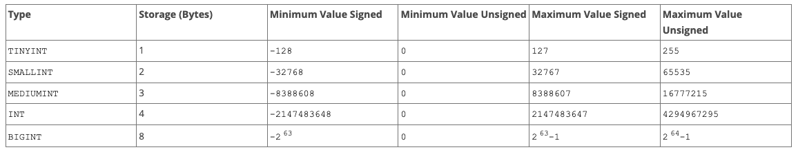
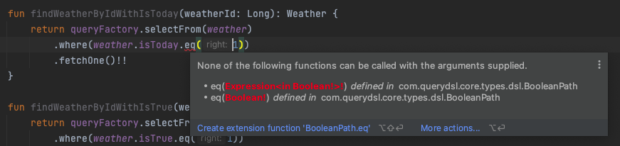
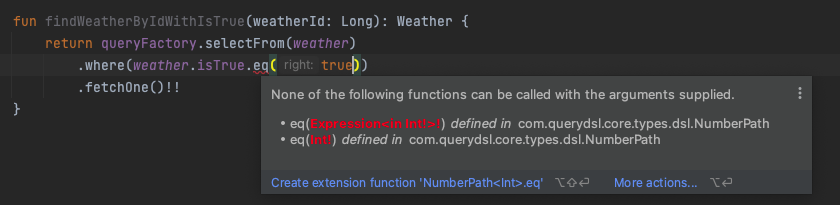
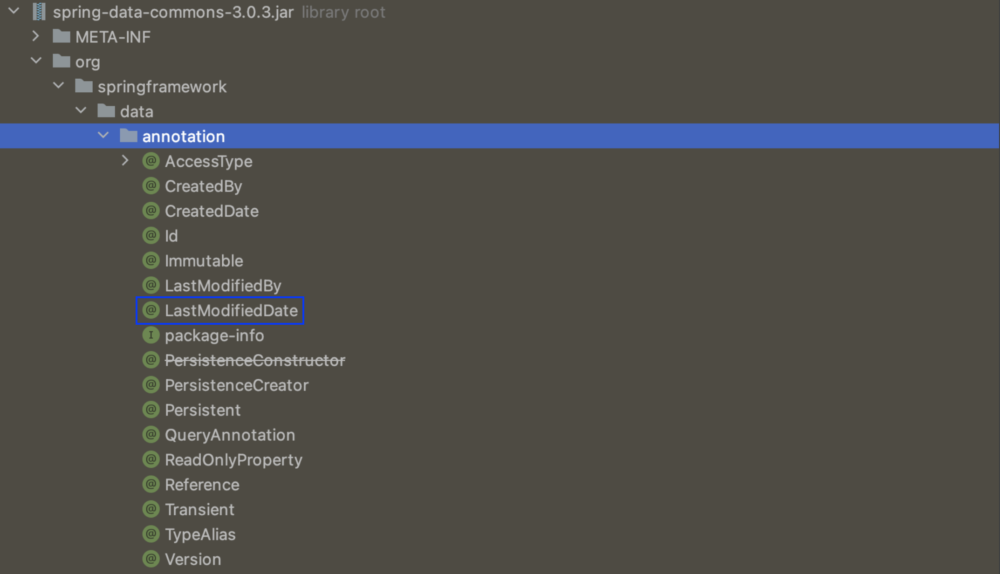
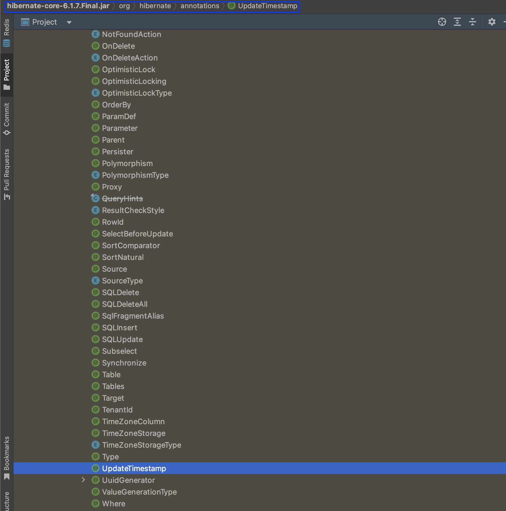
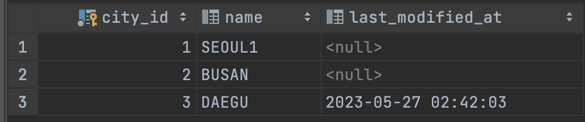
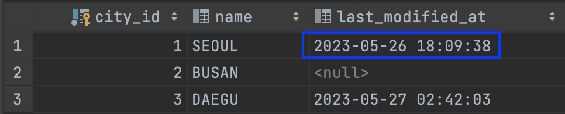

## 🚀 Data Type

JPA data type learning.


&nbsp;&nbsp; [1. TINYINT](#TINYINT) <br/>
&nbsp;&nbsp; [2. DATETIME / DATE / TIMESTAMP](#날짜) <br/>
&nbsp;&nbsp;&nbsp;&nbsp;&nbsp;&nbsp;&nbsp;&nbsp; - [2-1. @Temporal](#Temporal) <br/>
&nbsp;&nbsp;&nbsp;&nbsp;&nbsp;&nbsp;&nbsp;&nbsp; - [2-2. @LastModifiedDate / @UpdateTimestamp](#수정일-업데이트) <br/>
&nbsp;&nbsp; [3. Enum / Set](#ENUM과-SET)
&nbsp;&nbsp;&nbsp;&nbsp;&nbsp;&nbsp;&nbsp;&nbsp; - [3-1. ENUM](#ENUM) <br/>
&nbsp;&nbsp;&nbsp;&nbsp;&nbsp;&nbsp;&nbsp;&nbsp; - [3-2. SET](#SET) <br/>


<br/><br/><br/><br/>

## TINYINT

MySQL은 INTERE(또는 INT)와 SMALLINT SQL 표준 정수 타입을 지원합니다. 이 표준의 확장으로 MySQL은 [TINYINT](https://dev.mysql.com/doc/refman/8.0/en/integer-types.html), MEDIAINT, BIGINT 정수형도 지원합니다.

> MySQL supports the SQL standard integer types INTEGER (or INT) and SMALLINT. As an extension to the standard, MySQL
> also supports the integer types TINYINT, MEDIUMINT, and BIGINT. The following table shows the required storage and range
> for each integer type.

<br/><br/><br/><br/><br/><br/><br/><br/>

지원하는 데이터 타입과 범위는 아래 표와 같습니다.



<br/><br/><br/><br/><br/><br/><br/><br/>

이를 JPA로 매핑하기 위해서는 아래와 같이 `@Column(columnDefinition = "TINYINT")`라고 명시해 주면 됩니다.

````kotlin
@Entity
class Weather(
    @Id
    @GeneratedValue(strategy = GenerationType.IDENTITY)
    private var weatherId: Long? = null,

    @Column(nullable = false, columnDefinition = "TINYINT", length = 1)
    private val isTrue: Int
) {}
````

<br/><br/><br/><br/><br/><br/><br/><br/>

이는 Boolean 형태로 저장되기도 하는데요, 아래와 같이 매핑하더라도 오류가 나지 않습니다.

````kotlin
@Entity
class Weather(
    @Id
    @GeneratedValue(strategy = GenerationType.IDENTITY)
    private var weatherId: Long? = null,

    @Column(nullable = false, columnDefinition = "TINYINT", length = 1)
    private val isTrue: Int,

    @Column(nullable = false, columnDefinition = "TINYINT", length = 1)
    private val isToday: Boolean
) {}
````

<br/><br/><br/><br/><br/><br/><br/><br/>

실제 데이터 베이스에 생성된 타입을 보면 BOOLEAN이 아닌 TINYINT로 칼럼이 생성된 것을 볼 수 있습니다.

```sql
CREATE TABLE weather
(
    weather_id BIGINT AUTO_INCREMENT PRIMARY KEY,
    is_today   TINYINT NOT NULL,
    is_true    TINYINT NOT NULL
);
```

<br/><br/><br/><br/><br/><br/><br/><br/>

데이터를 조회할 때 아래와 같이 `TRUE/FALSE` 또는 `0/1`을 사용하면 됩니다.

````sql
SELECT *
FROM weather
WHERE is_today = TRUE
````

````sql
SELECT *
FROM weather
WHERE is_today = 1
````

<br/><br/><br/><br/><br/><br/><br/><br/>

단 이를 QueryDsl을 사용할 때는 정확히 일치하는 타입을 넣어줘야 합니다.

````kotlin
@Repository
class WeatherQueryDslRepository(private val queryFactory: JPAQueryFactory) {

    fun findWeatherByIdWithIsToday(weatherId: Long): Weather {
        return queryFactory.selectFrom(weather)
            .where(weather.isToday.eq(true))    // 정확한 타입으로 비교
            .fetchOne()!!
    }

    fun findWeatherByIdWithIsTrue(weatherId: Long): Weather {
        return queryFactory.selectFrom(weather)
            .where(weather.isTrue.eq(1))        // 정확한 타입으로 비교
            .fetchOne()!!
    }
}
````

<br/><br/><br/><br/><br/><br/><br/><br/>

오류 메시지를 보면 아래와 같이 정확한 타입을 넣으라는 것을 볼 수 있습니다. 





<br/><br/><br/><br/><br/><br/><br/><br/>

## 날짜

JPA에서 날짜에 관해 어떻게 매핑하고 처리하는지 살펴보겠습니다. 

<br/><br/><br/><br/>

### Temporal

@Temporal 어노테이션을 사용해 예약(Reservation) 테이블을 아래와 같이 매핑해줍니다.

````kotlin
@Entity
class Reservation(
    @Id
    @GeneratedValue(strategy = GenerationType.IDENTITY)
    private var reservationId: Long? = null,

    @Temporal(TemporalType.TIMESTAMP)
    @Column(name = "createdAt", updatable = false)
    private val createdAt: Instant? = Instant.now(),

    @Temporal(TemporalType.TIME)
    @Column(name = "firstModifiedAt")
    private val firstModifiedAt: Date? = Date(),

    @Temporal(TemporalType.DATE)
    @Column(name = "secondModifiedAt")
    private val secondModifiedAt: Instant? = Instant.now(),

    @Temporal(TemporalType.TIMESTAMP)
    @Column(name = "thirdModifiedAt", columnDefinition = "TIMESTAMP")
    private val thirdModifiedAt: Instant? = Instant.now(),

    @Temporal(TemporalType.DATE)
    @Column(name = "lastModifiedAt")
    private val lastModifiedAt: Date? = Date()
) {
}
````

<br/><br/><br/><br/><br/><br/><br/><br/>

생성된 테이블을 보면 아래와 같습니다. 이는 자바의 시간 관련 클래스 외에도 `@Temporal`의 값에 따라 데이터베이스의 칼럼 값들이 달라지는 것을 볼 수 있는데 `@Temporal(TemporalType.TIMESTAMP)는 DATETIME`에, `@Temporal(TemporalType.TIME)는 TIME`에, `@Temporal(TemporalType.DATE)는 DATE`에 매핑 됩니다.

````sql
CREATE TABLE reservation
(
    reservation_id     BIGINT      NOT NULL AUTO_INCREMENT PRIMARY KEY,
    created_at         DATETIME(6) NULL,
    first_modified_at  TIME        NULL,
    fourth_modified_at DATETIME(6) NULL,
    last_modified_at   DATE        NULL,
    second_modified_at DATE        NULL,
    third_modified_at  TIMESTAMP   NULL
) engine = InnoDB;
````

<br/><br/><br/><br/><br/><br/><br/><br/>

여기서 살펴볼 점이 있는데요, createdAt과 fourthModifiedAt 입니다. 둘 다 @Temporal(TemporalType.TIMESTAMP)로 매핑했지만 타입은 다릅니다. createdAt은 Instant, fourthModifiedAt은 LocalDateTime입니다.  

````kotlin
@Entity
class Reservation(
    
    ......
            
    @Temporal(TemporalType.TIMESTAMP)
    @Column(name = "createdAt", updatable = false)
    private val createdAt: Instant? = Instant.now(),

    ......
            
    @Temporal(TemporalType.TIMESTAMP)
    @Column(name = "fourthModifiedAt", updatable = false)
    private val fourthModifiedAt: LocalDateTime? = LocalDateTime.now(),
)
````

<br/><br/><br/><br/><br/><br/><br/><br/>

하지만 생성된 테이블을 보면 같은 타입의 칼럼인 것을 볼 수 있습니다. 이때 `어떤 것을 쓰는 게 더 좋을지`에 대한 고민이 들었는데 이에 대한 결론은 `운영 중인 서비스의 성격에 맞게 사용하는 것이 정답이다.`라는 것이었습니다. 즉 국내 서비스만을 위해서라면 LocalDate 타입도 나쁘지 않습니다. 반면 글로벌 서비스를 운영 중이라면 타임 존 이나 기타 여러 가지 사항을 고려해야 하기 때문에 Instant가 더 적절해 보였습니다. 따라서 자신이 운영 중인 서비스에 맞게 적절한 타입을 사용하면 될 것 같습니다.

````sql
CREATE TABLE reservation
(
    reservation_id     BIGINT      NOT NULL AUTO_INCREMENT PRIMARY KEY,
    created_at         DATETIME(6) NULL,
    
    ......
    
    fourth_modified_at DATETIME(6) NULL
) engine = InnoDB;
````

<br/><br/><br/><br/><br/><br/><br/><br/>

### 수정일 업데이트
@LastModifiedDate와 @UpdateTimestamp는 둘 다 JPA 엔티티에서 사용되는 어노테이션으로 `엔티티의 마지막 수정 날짜 및 시간을 추적`하는 데 사용됩니다. 그러나 두 어노테이션은 서로 다른 라이브러리에서 제공되며 약간의 차이가 있습니다.

<br/><br/><br/><br/>

@LastModifiedDate는 Spring Data JPA 라이브러리에서 제공됩니다. 이는 엔티티가 마지막으로 수정된 날짜 및 시간을 추적합니다. 해당 필드를 업데이트할 때마다 해당 시간이 자동으로 갱신되며 일반적으로 스프링 데이터 JPA의 AuditingEntityListener와 함께 사용되어 엔티티의 변경 이벤트에 응답하고 수정 시간을 업데이트합니다.

```kotlin
// Data JPA 라이브러리
package org.springframework.data.annotation;

......

/**
 * Declares a field as the one representing the date the entity containing the field was recently modified.
 *
 * @author Ranie Jade Ramiso
 * @author Oliver Gierke
 * @since 1.5
 */
@Retention(RetentionPolicy.RUNTIME)
@Target(value = { FIELD, METHOD, ANNOTATION_TYPE })
public @interface LastModifiedDate {
}
```

<br/><br/><br/><br/><br/><br/><br/><br/>

Spring Data JPA 패키지를 살펴보면 @LastModifiedDate 어노테이션이 있는 것을 볼 수 있습니다.  



<br/><br/><br/><br/><br/><br/><br/><br/>

@UpdateTimestamp는 Hibernate ORM 라이브러리에서 제공됩니다. 이 또한  엔티티가 마지막으로 수정된 날짜 및 시간을 추적합니다. 해당 필드를 업데이트할 때마다 해당 시간이 자동으로 갱신되며, Hibernate에서 제공하는 내장 기능으로 엔티티를 저장하거나 업데이트할 때 자동으로 설정됩니다.

````kotlin
package org.hibernate.annotations;

......

@ValueGenerationType(generatedBy = UpdateTimestampGeneration.class)
@Retention(RetentionPolicy.RUNTIME)
@Target({ FIELD, METHOD })
public @interface UpdateTimestamp {
}
````

<br/><br/><br/><br/><br/><br/><br/><br/>

Hibernate 패키지를 살펴보면 @LastModifiedDate 어노테이션이 있는 것을 볼 수 있습니다.  



<br/><br/><br/><br/><br/><br/><br/><br/>

이에 대해 실습을 진행해보겠습니다. 아래와 같이 도시(City) 테이블을 생성하고 엔티티를 매핑해줍니다. 

```sql
CREATE TABLE city
(
    city_id          BIGINT AUTO_INCREMENT PRIMARY KEY,
    name             VARCHAR(15) NULL,
    last_modified_at DATETIME    NULL
);
```

````kotlin
@Entity
class City(
    @Id
    @GeneratedValue(strategy = GenerationType.IDENTITY)
    private var cityId: Long? = null,

    @Column
    private var name: String,

    @UpdateTimestamp
    @Temporal(TemporalType.TIMESTAMP)
    @Column
    private val lastModifiedAt: Instant
) {
    fun getCityId(): Long? {
        return cityId
    }

    fun getName(): String {
        return name
    }

    fun updateName(name: String) {
        this.name = name
    }

    override fun equals(other: Any?): Boolean {
        if (this === other) return true
        if (other !is City) return false
        if (cityId != other.cityId) return false
        return true
    }

    override fun hashCode(): Int {
        return cityId?.hashCode() ?: 0
    }

    override fun toString(): String {
        return cityId.toString()
    }
}
````

<br/><br/><br/><br/><br/><br/><br/><br/>

현재 데이터베이스의 상태는 아래와 같습니다.



<br/><br/><br/><br/><br/><br/><br/><br/>

이후 도시의 이름을 업데이트 합니다.

```kotlin
@RestController
@RequestMapping("/api/cities")
class CityCommandAPI(private val cityCommandService: CityCommandService) {

    @PutMapping("/{cityId}")
    fun updateCityInformation(
        @PathVariable cityId: Long,
        @RequestBody request: CityUpdateRequest
    ): ResponseEntity<Unit> {
        cityCommandService.updateCity(cityId, request.name)
        return ResponseEntity.ok()
            .build()
    }
}
```
```kotlin
@Service
class CityCommandService(private val cityJpaRepository: CityJpaRepository) {

    @Transactional
    fun updateCity(
        cityId: Long,
        name: String
    ) {
        val findCity = cityJpaRepository.findById(cityId).get()
        findCity.updateName(name)
    }
}
```
<br/><br/><br/><br/><br/><br/><br/><br/>

업데이트를 한 후 데이터베이스를 살펴보면 아래와 같이 lastModifiedAt이 반영된 것을 볼 수 있습니다.



```http request
### City Update API

PUT localhost:8098/api/cities/1
Content-Type: application/json

{
  "name": "SEOUL1"
}
```
<br/><br/><br/><br/><br/><br/><br/><br/>

정리해 보면 `@LastModifiedDate`는 `Spring Data JPA와 함께 사용되는 스프링 기반의 어노테이션`이며, `@UpdateTimestamp`는 `Hibernate ORM과 함께 사용되는 Hibernate 기반의 어노테이션`입니다. 둘 다 엔티티의 마지막 수정 날짜를 추적하고 자동으로 갱신되지만 사용하는 ORM 라이브러리에 따라 선택할 수 있습니다.

<br/><br/><br/><br/><br/><br/><br/><br/>
