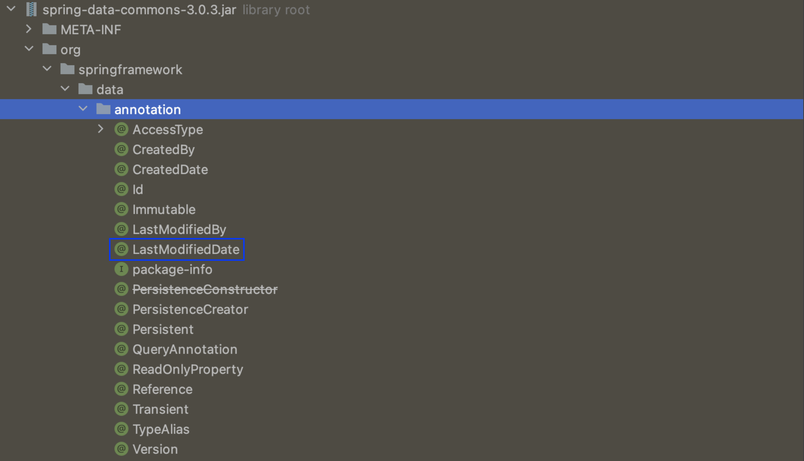
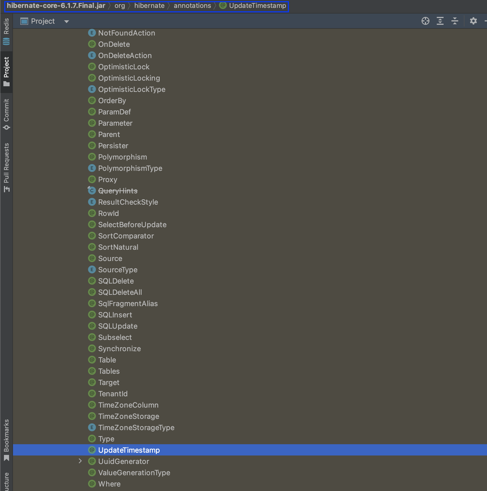
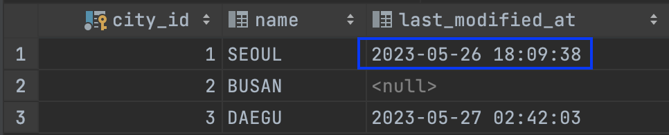

### 수정일 업데이트
@LastModifiedDate와 @UpdateTimestamp는 둘 다 JPA 엔티티에서 사용되는 어노테이션으로 `엔티티의 마지막 수정 날짜 및 시간을 추적`하는 데 사용됩니다. 그러나 두 어노테이션은 서로 다른 라이브러리에서 제공되며 약간의 차이가 있습니다.

<br/><br/><br/><br/>

@LastModifiedDate는 Spring Data JPA 라이브러리에서 제공됩니다. 이는 엔티티가 마지막으로 수정된 날짜 및 시간을 추적합니다. 해당 필드를 업데이트할 때마다 해당 시간이 자동으로 갱신되며 일반적으로 스프링 데이터 JPA의 AuditingEntityListener와 함께 사용되어 엔티티의 변경 이벤트에 응답하고 수정 시간을 업데이트합니다.

```kotlin
// Data JPA 라이브러리
package org.springframework.data.annotation;

......

/**
 * Declares a field as the one representing the date the entity containing the field was recently modified.
 *
 * @author Ranie Jade Ramiso
 * @author Oliver Gierke
 * @since 1.5
 */
@Retention(RetentionPolicy.RUNTIME)
@Target(value = { FIELD, METHOD, ANNOTATION_TYPE })
public @interface LastModifiedDate {
}
```

<br/><br/><br/><br/><br/><br/><br/><br/>

Spring Data JPA 패키지를 살펴보면 @LastModifiedDate 어노테이션이 있는 것을 볼 수 있습니다.



<br/><br/><br/><br/><br/><br/><br/><br/>

@UpdateTimestamp는 Hibernate ORM 라이브러리에서 제공됩니다. 이 또한  엔티티가 마지막으로 수정된 날짜 및 시간을 추적합니다. 해당 필드를 업데이트할 때마다 해당 시간이 자동으로 갱신되며, Hibernate에서 제공하는 내장 기능으로 엔티티를 저장하거나 업데이트할 때 자동으로 설정됩니다.

````kotlin
package org.hibernate.annotations;

......

@ValueGenerationType(generatedBy = UpdateTimestampGeneration.class)
@Retention(RetentionPolicy.RUNTIME)
@Target({ FIELD, METHOD })
public @interface UpdateTimestamp {
}
````

<br/><br/><br/><br/><br/><br/><br/><br/>

Hibernate 패키지를 살펴보면 @LastModifiedDate 어노테이션이 있는 것을 볼 수 있습니다.



<br/><br/><br/><br/><br/><br/><br/><br/>

이에 대해 실습을 진행해보겠습니다. 아래와 같이 도시(City) 테이블을 생성하고 엔티티를 매핑해줍니다.

```sql
CREATE TABLE city
(
    city_id          BIGINT AUTO_INCREMENT PRIMARY KEY,
    name             VARCHAR(15) NULL,
    last_modified_at DATETIME    NULL
);
```

````kotlin
@Entity
class City(
    @Id
    @GeneratedValue(strategy = GenerationType.IDENTITY)
    private var cityId: Long? = null,

    @Column
    private var name: String,

    @UpdateTimestamp
    @Temporal(TemporalType.TIMESTAMP)
    @Column
    private val lastModifiedAt: Instant
) {
    fun getCityId(): Long? {
        return cityId
    }

    fun getName(): String {
        return name
    }

    fun updateName(name: String) {
        this.name = name
    }

    override fun equals(other: Any?): Boolean {
        if (this === other) return true
        if (other !is City) return false
        if (cityId != other.cityId) return false
        return true
    }

    override fun hashCode(): Int {
        return cityId?.hashCode() ?: 0
    }

    override fun toString(): String {
        return cityId.toString()
    }
}
````

<br/><br/><br/><br/><br/><br/><br/><br/>

현재 데이터베이스의 상태는 아래와 같습니다.


<br/><br/><br/><br/><br/><br/><br/><br/>

이후 도시의 이름을 업데이트 합니다.

```kotlin
@RestController
@RequestMapping("/api/cities")
class CityCommandAPI(private val cityCommandService: CityCommandService) {

    @PutMapping("/{cityId}")
    fun updateCityInformation(
        @PathVariable cityId: Long,
        @RequestBody request: CityUpdateRequest
    ): ResponseEntity<Unit> {
        cityCommandService.updateCity(cityId, request.name)
        return ResponseEntity.ok()
            .build()
    }
}
```
```kotlin
@Service
class CityCommandService(private val cityJpaRepository: CityJpaRepository) {

    @Transactional
    fun updateCity(
        cityId: Long,
        name: String
    ) {
        val findCity = cityJpaRepository.findById(cityId).get()
        findCity.updateName(name)
    }
}
```
<br/><br/><br/><br/><br/><br/><br/><br/>

업데이트를 한 후 데이터베이스를 살펴보면 아래와 같이 lastModifiedAt이 반영된 것을 볼 수 있습니다.



```http request
### City Update API

PUT localhost:8098/api/cities/1
Content-Type: application/json

{
  "name": "SEOUL1"
}
```
<br/><br/><br/><br/><br/><br/><br/><br/>

정리해 보면 `@LastModifiedDate`는 `Spring Data JPA와 함께 사용되는 스프링 기반의 어노테이션`이며, `@UpdateTimestamp`는 `Hibernate ORM과 함께 사용되는 Hibernate 기반의 어노테이션`입니다. 둘 다 엔티티의 마지막 수정 날짜를 추적하고 자동으로 갱신되지만 사용하는 ORM 라이브러리에 따라 선택할 수 있습니다.
