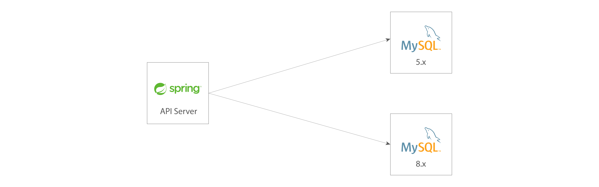

## 🫐 Multi DataSource

Multi-DataSource learning repository.

    

### 같은 종류, 다른 버전 데이터베이스

회사에서 기존에 사용하던 데이터베이스(MySQL)와 새로운 데이터베이스의 버전이 달라서 고민했던 내용입니다. 기존 데이터베이스는 5.XX 버전을 사용 중이었고 신규 런칭 프로젝트는 8.XX 버전을 사용하게
되었습니다.

        

`버전이 다르기 때문에 애플리케이션이 두 데이터베이스를 바라볼 때 어떤 문제가 있진 않을까?` 하는 걱정을 했었는데요, 결론적으로 각 스프링에서 별도로 신경 쓸 내용은 그다지 없었습니다. 데이터베이스의 설정은 각각
하더라도 MySQL이 [하위 버전과의 호환성을 지원](https://dev.mysql.com/doc/connector-j/8.0/en/connector-j-versions.html)하기 때문입니다. 따라서 스프링에서
상위 버전의 의존성을 넣어주고 매핑만 제대로 한다면 신경쓸 내용은 없습니다.

> implementation("mysql:mysql-connector-java:8.0.28")
