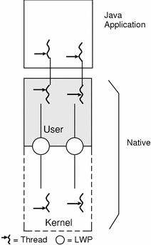
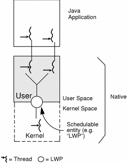
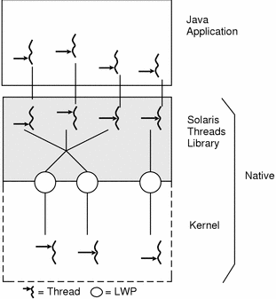
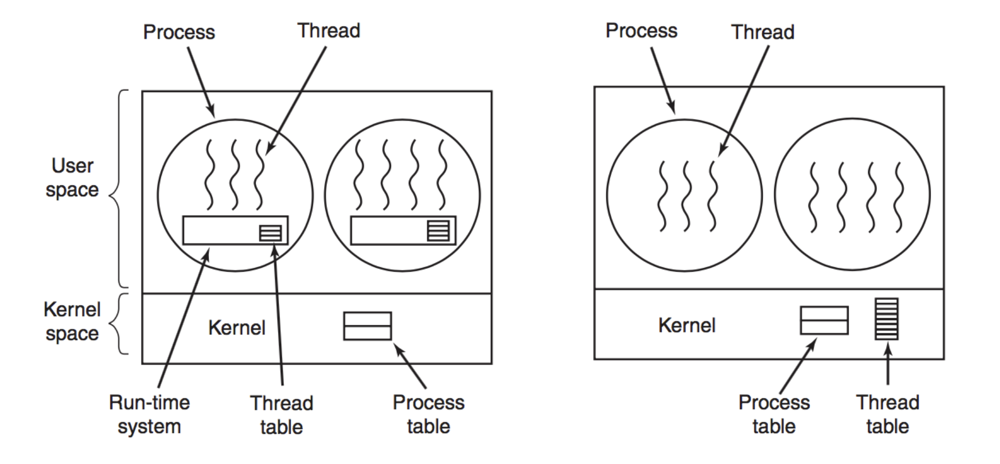
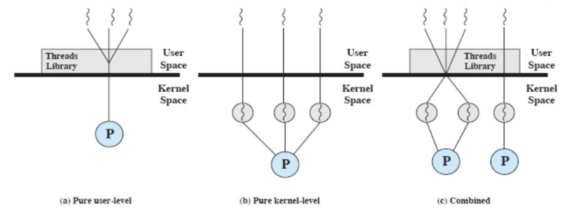
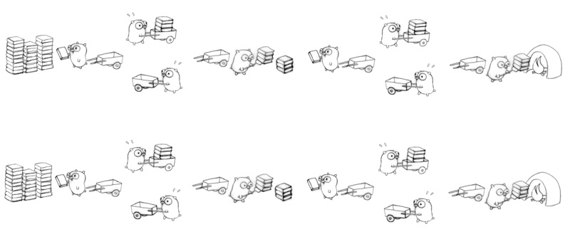

## 쓰레드 모델

[자바의 쓰레드 모델](https://medium.com/@unmeshvjoshi/how-java-thread-maps-to-os-thread-e280a9fb2e06)과 간략한 운영체제의 내용을 살펴보겠습니다. 

> 이미지 클릭 시 출처를 알 수 있습니다. 

    

### One to One 

일대일 모델은 각 사용자 레벨 쓰레드를 각각 하나의 커널 쓰레드에 매핑합니다. 따라서 하나의 쓰레드가 Blocking 되더라도 다른 쓰레드가 실행될 수 있으므로 병렬 실행이 용이합니다.

&nbsp;&nbsp; - 하나의 사용자 레벨 쓰레드를 하나의 커널 쓰레드에 매핑합니다.  
&nbsp;&nbsp; - 하나가 Blocking 됐을 때 나머지도 Blocking되는 문제를 해결할 수 있습니다.  
&nbsp;&nbsp; - 멀티 코어나 멀티 프로세스의 이점을 활용할 수 있습니다.  
&nbsp;&nbsp; - 단, 커널 쓰레드가 많이 생기면 성능상 이슈가 발생할 수 있습니다.  
&nbsp;&nbsp; - Window/Linux 등이 해당 모델 채택  

> 커널/사용자 레벨 쓰레드에 대해 이해가 가지 않는 다면 [해당 글](https://www.tutorialspoint.com/user-level-threads-and-kernel-level-threads)을 참조해 간략히 이해하실 것을 권장드립니다. 

        

### Many To One

다대일 모델은 여러 사용자 레벨 쓰레드를 하나의 커널 쓰레드에 매핑합니다. 쓰레드는 `사용자 공간의 쓰레드 라이브러리에 의해 관리`됩니다.

&nbsp;&nbsp; - 여러 개의 사용자 레벨 쓰레드를 하나의 커널 수준 쓰레드에 매핑합니다.  
&nbsp;&nbsp; - 사용자 레벨 쓰레드는 라이브러리에 의해 관리됩니다.  
&nbsp;&nbsp; - 만약 사용자 레벨 쓰레드중 하나가 시스템 콜(System Call)에 의해 Blocking 되면 맵핑된 커널 수준 쓰레드도 Blocking 될 수 있습니다.  
&nbsp;&nbsp; - 동시적으로 작업을 할 수는 있지만 병렬적으로 작업을 처리할 수 없습니다. 
&nbsp;&nbsp; - 멀티코어(multi-core)나 멀티프로세스의 이점을 충분히 이용할 수 없다.  

        

### Many To Many

다대다 모델은 여러 개의 사용자 레벨 쓰레드를 그보다 작은 수 혹은 같은 수의 커널 쓰레드에 매핑합니다.

&nbsp;&nbsp; - Blocking 문제가 발생하지 않습니다.  
&nbsp;&nbsp; - 가장 유연 하지만 구현하기가 어려워 많이 채택하지는 않습니다.  
&nbsp;&nbsp; - Many To Many 모델을 응용한 [Two-level 모델](http://what-when-how.com/Tutorial/Multithreaded-Programming-with-JAVA/Multithreaded-Programming-with-JAVA-00045.html)이 있습니다.  
&nbsp;&nbsp; - 멀티 코어나 멀티 프로세스의 이점을 활용할 수 있습니다.  

        

사용자 레벨에서의 쓰레드는 커널 입장에서는 [LWP(Light-Weight Process)](https://en.wikipedia.org/wiki/Light-weight_process) 입니다. 이는 결국 운영체제 레벨에서 프로세스 스케줄러에 의해 관리되기 때문입니다. 

> In computer operating systems, a light-weight process (LWP) is a means of achieving multitasking. In the traditional meaning of the term, as used in Unix System V and Solaris, a LWP runs in user space on top of a single kernel thread and shares its address space and system resources with other LWPs within the same process. Multiple user-level threads, managed by a thread library, can be placed on top of one or many LWPs - allowing multitasking to be done at the user level, which can have some performance benefits. 

        

이때 쓰레드가 사용자 공간에서 관리되는 경우 각 프로세스에는 해당 프로세스의 쓰레드를 추적하기 위해 쓰레드 테이블이 필요합니다. 이는 [Runtime-System](https://en.wikipedia.org/wiki/Runtime_system) 내부에 존재합니다. 반면 커널에서 이를 관리하는 경우 커널 레벨에서 모든 쓰레드를 추적하는 테이블이 있습니다. 새로운 쓰레드를 생성/삭제하는 경우 커널 호출을 한 후 커널 쓰레드 테이블을 업데이트하여 라이프사이클을 관리합니다.

        

자바/스프링 MVC에서는 모델 b를 택하고 있는데요, 따라서 main 쓰레드에서 실행되는 프로그램이 여러 개의 쓰레드를 관리/사용할 수 있습니다. 따라서 자바의 쓰레드는 하나가 Blocking을 당해도 다른 쓰레드들 까지 Blocking 당하지 않습니다. 하지만 스프링을 사용하면 멀티 쓰레드로 동작하다보니 공유자원 문제가 발생할 수 있어 주의해야 합니다. 

> 자바 1.2버전 이전까지는 [JVM이 쓰레드 스케줄링을 담당](https://en.wikipedia.org/wiki/Green_thread)했습니다.

        

OS가 아닌 런타임 라이브러리나 VM에 의해 쓰레드를 스케쥴링하는 것을 그린 쓰레드(Green Thread)라고 부릅니다. 이는 시스템 콜로 인해 한 쓰렏가 Blocking 당하면 나머지 쓰레드도 모두 Blocking을 당하게 됩니다. 이는 OS가 쓰레드 API를 지원하지 않으며 OS의 쓰레드 기능을 사용할 수 있지만 여러 개의 CPU 코어를 사용할 수 없는 단점이 있습니다.

> When a green thread executes a blocking system call, not only is that thread blocked, but all of the threads within the process are blocked. To avoid that problem, green threads must use asynchronous I/O operations, although the increased complexity on the user side can be reduced if the virtual machine implementing the green threads spawns specific I/O processes (hidden to the user) for each I/O operation

        

## [병렬과 동시성](https://stackoverflow.com/questions/1050222/what-is-the-difference-between-concurrency-and-parallelism) 

병렬(Parallelism)은 `여러 작업이 동시에 실행되는 것`. 병렬 처리는 하나 이상의 작업을 `동시에 실행`하여 작업을 더 빠르게 처리합니다. 반면 동시성(Concurrency)은 동시에 실행되는 여러 개의 작업이 존재하는 상태를 가리킵니다. 동시성은 하나의 작업이 여러 작업과 상호작용하며 동시에 진행될 수 있습니다. 즉 멀티스레딩이나 이벤트 기반 시스템에서 여러 작업이 동시에 실행되는 것처럼 보이지만 실제로는 작업이 번갈아 가면서 실행되는 것입니다.

> 두 개념은 동시에 여러 작업을 처리하지만 병렬성은 `물리적으로 여러 작업을 동시에 처리하는 것`을 강조하고, 동시성은 `논리적으로 여러 작업을 동시에 실행하는 것`을 강조합니다. 동시성은 실행 순서와 상호작용에 대해 신경 쓸 부분도 고려해야 합니다.

        

그림으로 보면 조금 더 직관적인데요, 위는 Concurrency, 아래는 Parallelism 입니다.

