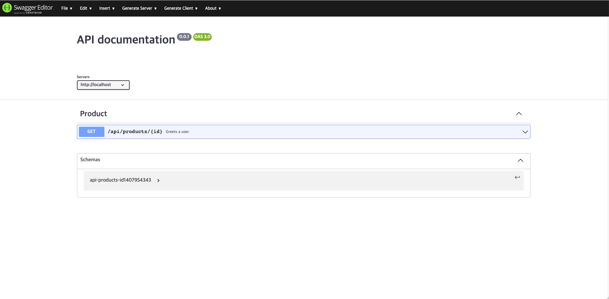

## Swagger with Restdocs-Api-Spec

Swagger with [Restdocs-api-spec]((https://github.com/ePages-de/restdocs-api-spec)) multi module practice. Restdocs-Api-Spec adds API specifications as an output format to Spring REST Docs. It currently supports:

&nbsp;&nbsp; - [OpenAPI 2.0](https://github.com/OAI/OpenAPI-Specification/blob/main/versions/2.0.md) in json and yaml <br/>
&nbsp;&nbsp; - [OpenAPI 3.0.1](https://github.com/OAI/OpenAPI-Specification/blob/main/versions/3.0.1.md) in json and yaml <br/>
&nbsp;&nbsp; - [Postman Collections 2.1.0](https://schema.postman.com/json/collection/v2.1.0/docs/index.html)

<br/><br/>

<div align="center">

[](https://github.com/spring-projects/spring-framework)
[](https://github.com/spring-projects/spring-restdocs) [](https://github.com/ePages-de/restdocs-api-spec)<br/>[](https://hub.docker.com/r/swaggerapi/swagger-ui) [](https://hub.docker.com/r/swaggerapi/swagger-editor/)


</div>


<br/><br/><br/><br/>

## Getting Started

> You should install jdk 17 or higher. <br/>

<br/><br/><br/>

## Run Application

Please run the application after modifying the port in `docker-compose.yml`. You can put the json file inside the docker or enter it directly into the UI. I'll leave the part about document automation to you for learning.

````text
$ cd docker
$ docker-compose up   

$ ./gradlew :user-api:bootRun
$ ./gradlew :product-api:bootRun
````

<br/><br/>

## Run Test

````text
$ ./gradlew :user-api:test
$ ./gradlew :product-api:test
````

<br/><br/>

## Run Build

````text
$ ./gradlew :user-api:build
$ ./gradlew :product-api:build
````

<br/><br/>

## Result

After the build, you can see that api-spec is extracted in json format.

````json
{
  "openapi" : "3.0.1",
  "info" : {
    "title" : "Product API Documentation",
    "description" : "Product API Documentation",
    "version" : "1.0.0"
  },
  "servers" : [ {
    "url" : "www.product-domain.com"
  } ],
  "tags" : [ ],
  "paths" : {
    "/api/products/{id}" : {
      "get" : {
        "tags" : [ "Product" ],
        "summary" : "Product details searching.",
        "description" : "API for searching product details by id.",
        "operationId" : "product-search-by-id-documentation-test/product_search_by_id_test",
        "parameters" : [ {
          "name" : "id",
          "in" : "path",
          "description" : "Product id.",
          "required" : true,
          "schema" : {
            "type" : "number"
          }
        } ],
        "responses" : {
          "200" : {
            "description" : "200",
            "content" : {
              "application/json" : {
                "schema" : {
                  "$ref" : "#/components/schemas/api-products-id1407954343"
                },
                "examples" : {
                  "product-search-by-id-documentation-test/product_search_by_id_test" : {
                    "value" : "{\"id\":1,\"name\":\"PUMA\"}"
                  }
                }
              }
            }
          }
        }
      }
    }
  },
  "components" : {
    "schemas" : {
      "api-products-id1407954343" : {
        "type" : "object",
        "properties" : {
          "name" : {
            "type" : "string",
            "description" : "Product name."
          },
          "id" : {
            "type" : "number",
            "description" : "Product id."
          }
        }
      }
    }
  }
}
````

<br/><br/><br/><br/><br/><br/>

You can also use API documents in conjunction with the Swagger UI/Editor as follows.





## Env

&nbsp;&nbsp; - Kotlin 1.7  <br/>
&nbsp;&nbsp; - SpringBoot 3.0 <br/>
&nbsp;&nbsp; - Restdocs-Api-Spec 0.17.1 <br/>

<br/>
