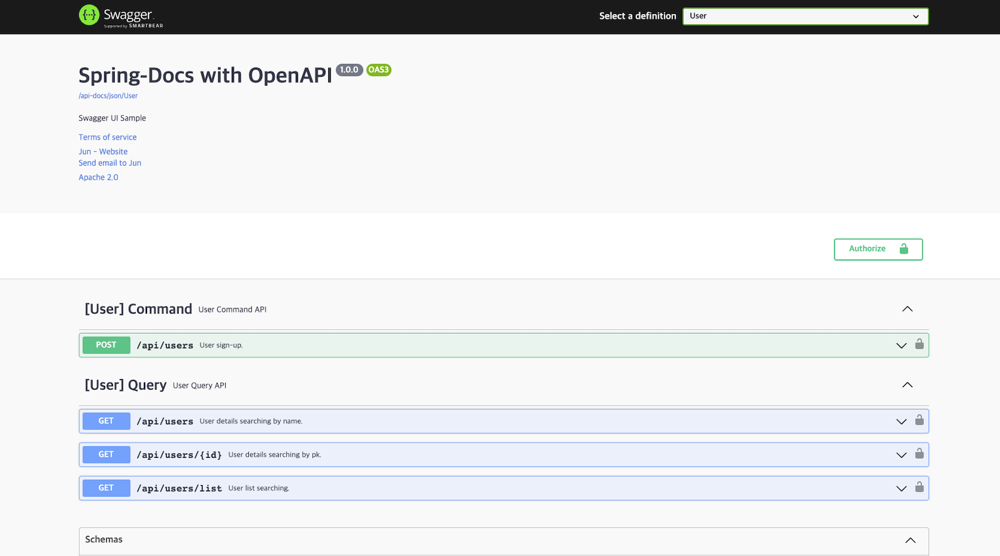

# SpringDocs OpenAPI


<div align="center">

SpringDocs OpenAPI single module practice.

[](https://github.com/spring-projects/spring-framework)
[](https://springdoc.org/) <br/>
[](https://github.com/springdoc/springdoc-openapi)

</div>

<br/><br/><br/><br/>

## Getting Started

> You should install jdk 17 or higher. <br/>
> You must set up the application.yml.

<br/><br/><br/>

## Run Application

````text
./gradlew bootRun
````

<br/><br/>

## Run Test

````text
./gradlew test
````

<br/><br/>

## Run Build

````text
./gradlew build
````

<br/><br/>

## Result

You can see the Swagger UI by running the application and accessing `http://localhost:8080/swagger-ui/index.html`.




<br/><br/><br/>

## Env

&nbsp;&nbsp; - Kotlin 1.7  <br/>
&nbsp;&nbsp; - SpringBoot 3.0 <br/> 
&nbsp;&nbsp; - Springdoc Openapi 2.0.4

<br/>
